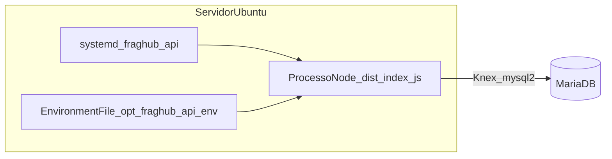

# C4 L2 — Auth API (Contentores)

## Notas

- Um único processo Node serve **health** e **auth** no mesmo porto (default **3001**).
- Cookies de refresh limitados a `path: /auth` na spec; Nginx (futuro `nginx-ssl`) pode expor `/auth` e `/api` com o mesmo upstream.
