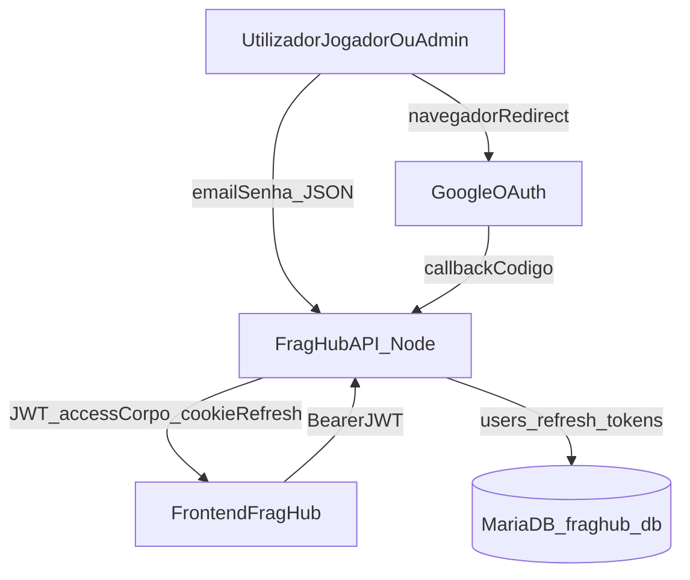

# C4 L1 — Auth API (Contexto)

## Notas

- O **frontend** ainda não existe na v0.3 completa; o fluxo OAuth assume `FRONTEND_URL` configurável.
- **Steam** e **plugins** ficam fora deste diagrama (features separadas).
