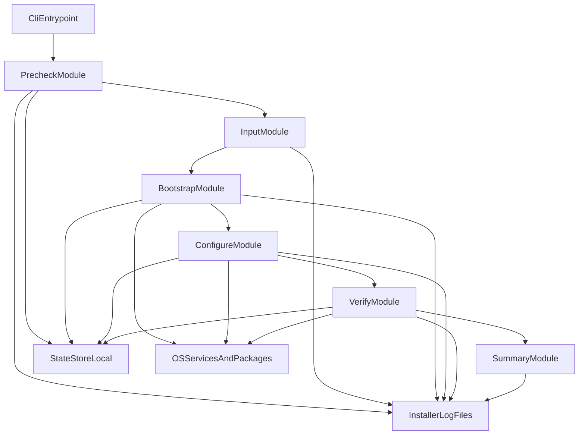

# C4 L2 - CLI Installer Containers

## Notas

- `StateStoreLocal` suporta idempotencia basica e recuperacao de falha parcial.
- `InstallerLogFiles` registra diagnostico sem expor segredos em texto puro.

