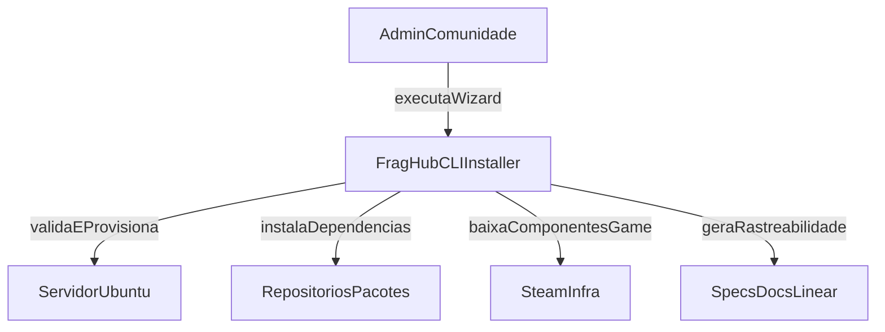

# C4 L1 - CLI Installer Context

## Notas

- Este diagrama mostra apenas a relacao do installer com atores/sistemas externos.
- Persistencia funcional de produto (matches/stats) nao esta no escopo de v0.1.

