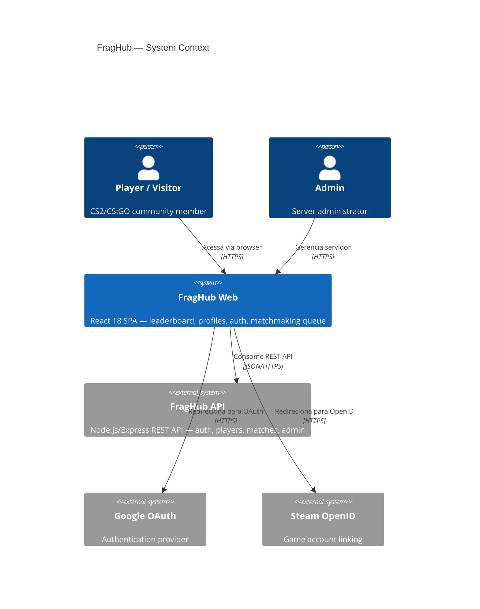
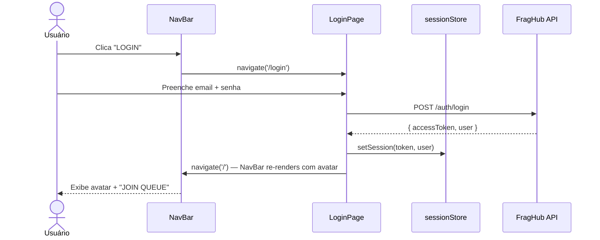

# C4 Architecture — Frontend Refactor Stitch

**Feature:** `frontend-refactor-stitch`
**Date:** 2026-04-17
**Levels:** L1 (Context) + L2 (Container)

---

## L1 — Context Diagram



---

## L2 — Container Diagram

```mermaid
C4Container
  title FragHub Web — Container View (pós-refactor)

  Person(user, "Usuário")

  Container_Boundary(spa, "fraghub-web (React SPA)") {
    Component(router, "React Router v6", "Roteamento client-side. Layout wraps rotas públicas.")
    Component(layout, "Layout + NavBar", "Shell persistente. Glassmorphism. Links + auth CTAs.")

    Component(home, "HomePage", "Hero + Stats + FeatureCards")
    Component(leaderboard, "LeaderboardPage", "Podium + RankingTable + filtros/paginação")
    Component(auth, "LoginPage / RegisterPage", "Auth forms com Button + InputField + ErrorAlert")
    Component(profile, "ProfilePage / PublicProfilePage", "Stats grid + match history + LevelBadge")
    Component(admin, "Admin Pages", "Dashboard, Players, Servers, Logs (tokens herdados)")

    Component(design_system, "Design System", "index.css — 34+ CSS custom properties Tactical Monolith")
    Component(ui_atoms, "UI Atoms (ui/)", "Button, InputField, ErrorAlert, LoadingSpinner")
    Component(visual, "Visual Components", "LevelBadge, PlayerAvatar, RankingTable, PodiumSection")

    Component(store, "Zustand Store", "sessionStore — JWT, user state")
    Component(services, "Services", "httpClient, playerService, leaderboardService")
  }

  System_Ext(api, "FragHub API", "Node.js REST")
  System_Ext(nginx, "Nginx", "Static file serving + reverse proxy")

  Rel(user, nginx, "HTTPS request")
  Rel(nginx, spa, "Serve static SPA")
  Rel(router, layout, "Outlet via Layout")
  Rel(layout, home, "Route /")
  Rel(layout, leaderboard, "Route /leaderboard")
  Rel(layout, auth, "Route /login /register")
  Rel(layout, profile, "Route /players/*")
  Rel(admin, design_system, "Herda tokens CSS")
  Rel(home, ui_atoms, "usa Button")
  Rel(leaderboard, visual, "usa RankingTable, LevelBadge, PodiumSection")
  Rel(auth, ui_atoms, "usa Button, InputField, ErrorAlert")
  Rel(profile, visual, "usa LevelBadge, PlayerAvatar")
  Rel(services, api, "REST/JSON", "HTTPS")
  Rel(store, services, "Gerencia tokens JWT")
```

---

## Sequence Diagram — Login Flow (feature-scoped)


