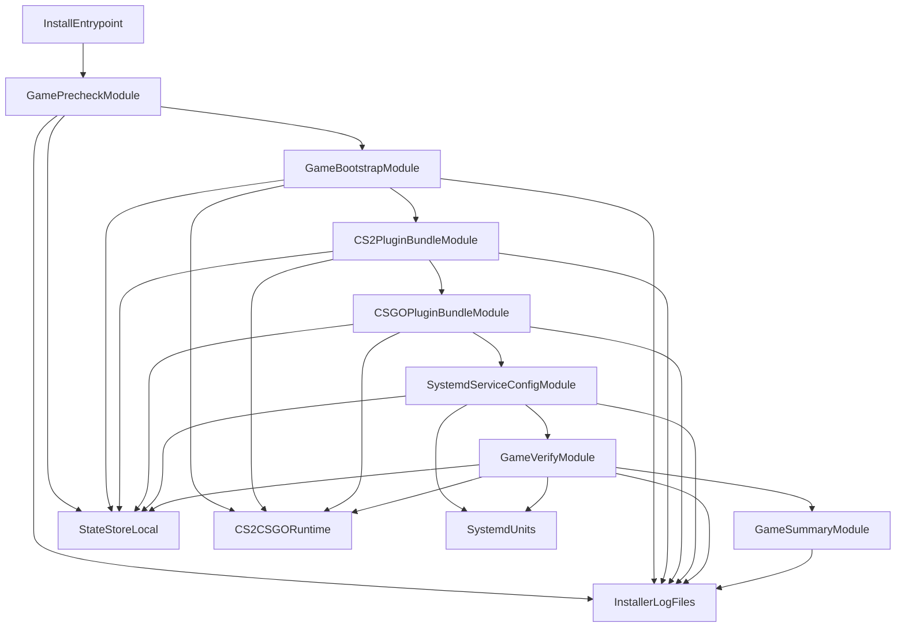

# C4 L2 - Game Stack Baseline Containers

## Notas

- `StateStoreLocal` garante idempotencia por etapa e por trilha de jogo.
- Os bundles CS2/CS:GO permanecem separados para isolamento de falha e reexecucao parcial.
