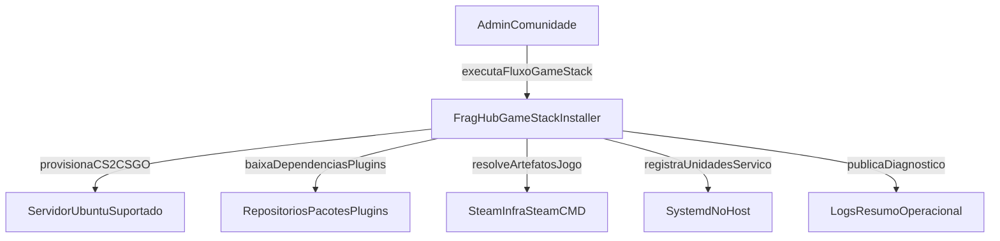

# C4 L1 - Game Stack Baseline Context

```mermaid
flowchart TD
  adminUser[AdminComunidade]
  targetServer[ServidorUbuntuSuportado]
  gameInstaller[FragHubGameStackInstaller]
  packageRepos[RepositoriosPacotesPlugins]
  steamInfra[SteamInfraSteamCMD]
  systemdLayer[SystemdNoHost]
  observability[LogsResumoOperacional]

  adminUser -->|executaFluxoGameStack| gameInstaller
  gameInstaller -->|provisionaCS2CSGO| targetServer
  gameInstaller -->|baixaDependenciasPlugins| packageRepos
  gameInstaller -->|resolveArtefatosJogo| steamInfra
  gameInstaller -->|registraUnidadesServico| systemdLayer
  gameInstaller -->|publicaDiagnostico| observability
```

## Notas

- O contexto mostra a feature apos pre-condicao do `cli-installer` concluida.
- Escopo restrito ao baseline operacional de jogo em v0.1.
