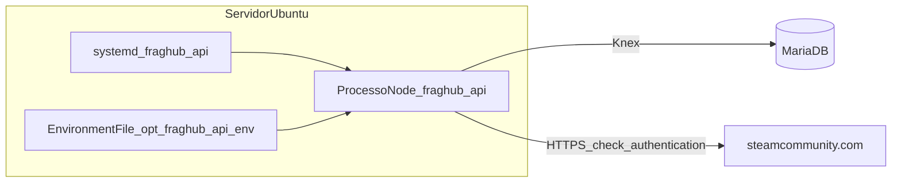

# C4 L2 — Steam integration (contentores)

## Notas

- Mesmo processo Node que serve **auth** e **health** expõe rotas `/auth/steam/*` e `/api/player/*` (montagem em `index.ts`).
- **Nginx** (futuro) pode expor apenas paths necessários ao exterior.
