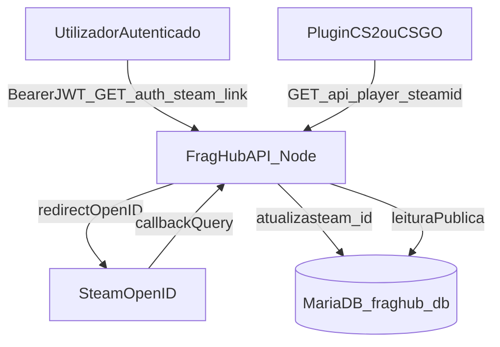

# C4 L1 — Steam integration (contexto)

## Notas

- **Login** não passa pela Steam; apenas **vinculação** pós-sessão `auth-api`.
- O **portal** (v0.4) consome redirects para `FRONTEND_URL` após callback.
